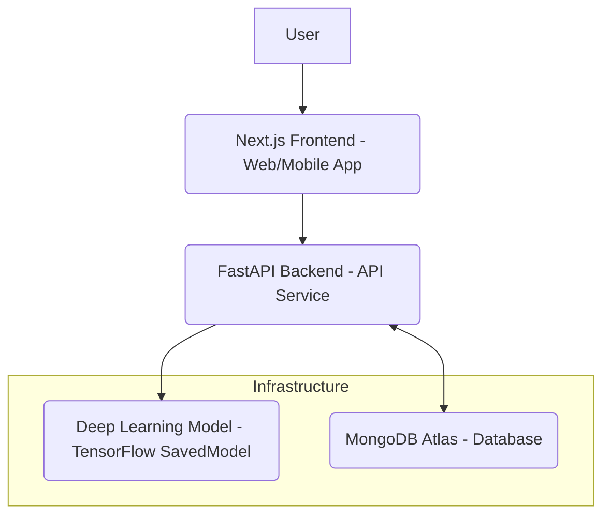

# Sheep Pain Assessment System

**Automated Assessment of Pain in Sheep using Deep Learning**

This project delivers a full-stack solution for the automated assessment of pain in sheep based on facial expressions using deep learning. It comprises a Next.js-based frontend for user interaction, a FastAPI backend for handling image processing and model inference, and a comprehensive machine learning pipeline for training and evaluating the pain assessment models. Prediction records are stored in a MongoDB database.

## Table of Contents

- [Project Overview](#project-overview)
- [Overall Architecture](#overall-architecture)
- [Key Features](#key-features)
- [Technology Stack](#technology-stack)
- [Setup and Running the Application](#setup-and-running-the-application)
  - [Prerequisites](#prerequisites)
  - [1. Machine Learning Models (Data Preparation & Training)](#1-machine-learning-models-data-preparation--training)
  - [2. Backend Service (API)](#2-backend-service-api)
  - [3. Frontend Application (Next.js)](#3-frontend-application-react)
- [Deployment Considerations](#deployment-considerations)
- [Contributing](#contributing)
- [License](#license)
- [Contact](#contact)

## 1. Project Overview

The core objective of this system is to improve animal welfare by providing a non-invasive, automated method for detecting pain in sheep. Leveraging computer vision and deep learning, the system analyzes images of sheep faces to classify whether an animal is exhibiting signs of pain. The application is designed to be user-friendly, allowing caretakers to easily upload images and receive immediate feedback, with all predictions recorded for historical tracking.

## 2. Overall Architecture

The system follows a typical client-server architecture with a clear separation of concerns:



- **Next.js Frontend**: The user-facing application for image upload, displaying predictions, and viewing historical records.
- **FastAPI Backend**: Acts as the API layer, receiving requests from the frontend, orchestrating image preprocessing, performing ML inference, and managing data persistence.
- **Deep Learning Model**: A pre-trained TensorFlow/Keras model (MobileNetV2 based) responsible for the core pain classification.
- **MongoDB Atlas**: A cloud-hosted NoSQL database used to store historical prediction data associated with unique device IDs.

## 3. Key Features

- **Automated Pain Assessment**: Real-time classification of sheep pain from images.
- **Intuitive User Interface**: Easy image upload and clear display of results.
- **Data Persistence**: Storage of prediction records for auditing and analysis.
- **Imbalance Handling**: Training pipeline specifically designed to address class imbalance in pain datasets.
- **Scalable Architecture**: Modular design supporting future enhancements and increased load.

## 4. Technology Stack

- **Frontend**: Next.js, HTML, CSS, JavaScript
- **Backend**: Python 3.9+, FastAPI, Uvicorn, PyMongo
- **Machine Learning**: TensorFlow/Keras, NumPy, Pillow, Scikit-learn
- **Database**: MongoDB Atlas (Cloud)
- **Tools**: Git, virtual environments, Google Colab (for ML training)

## 5. Setup and Running the Application

To run the full application, you need to set up each component. It's recommended to follow the order below.

### Prerequisites

- Python 3.9+
- pip (Python package installer)
- Node.js and npm (for the Next.js frontend)
- A MongoDB Atlas account and a free tier (M0) cluster configured (see Backend README for details).

### 1. Machine Learning Models (Data Preparation & Training)

This step prepares your deep learning model and the structured dataset for the backend.

- **Goal**: Train the `sheep_pain_assessment_model_balanced` and have your dataset (`sheep_pain_dataset_split`) ready.
- **Location**: Refer to the `models/` directory (or wherever your training script is located).
- **Instructions**: Follow the detailed steps in the README: Machine Learning Models to:
  - Upload your raw dataset to Google Colab.
  - Run the data splitting and oversampling script.
  - Train and evaluate the MobileNetV2 model.
  - Download the saved model directory (e.g., `sheep_pain_assessment_model_balanced/`).
  - Place this downloaded model in your `backend/ml/` directory.

### 2. Backend Service (API)

This runs the FastAPI application that serves predictions and handles database operations.

- **Goal**: Have the backend API running and accessible.
- **Location**: `backend/` directory.
- **Instructions**: Follow the detailed steps in the README: Backend (FastAPI) to:
  - Clone the repository.
  - Set up your MongoDB Atlas connection string in a `.env` file.
  - Install Python dependencies.
  - Place the trained ML model in `backend/ml/`.
  - Run the Uvicorn server.
  - **Note**: Keep the backend server running while developing and testing the frontend.

### 3. Frontend Application (Next.js)

This is the user interface where users will interact with the system.

- **Goal**: Run the Next.js development server.
- **Location**: `frontend/` directory (if separate, or assume it's part of the main repo).
- **Instructions**:

  1. Navigate to your Next.js frontend directory:

     ```bash
     cd ComputerVision/frontend
     ```

  2. Install Node.js dependencies:

     ```bash
     npm install
     ```

  3. **Configure API Endpoint**: In your frontend app's env file, you'll need to specify the URL of your running backend API. If running locally, this would be `http://localhost:8000`. If you deploy your backend to a cloud service, you'll use its public URL.

  4. Start the Next.js development server:
     ```bash
     npm start
     ```
     This typically opens the app in your browser at `http://localhost:3000`.

## 6. Deployment Considerations

- **Backend Hosting**: For free deployment, consider platforms like:

  - **Google Cloud Run**: Excellent for containerized FastAPI apps, generous free tier.
  - **Render (Free Tier)**: Offers free web services that might spin down.
  - **Vercel/Netlify (for Frontend)**: Already well-suited for your Next.js app.

- **MongoDB Atlas**: The M0 Sandbox cluster is free and generally sufficient for development and small projects.

- **Security**: Always review CORS settings, environment variable management, and database access rules before deploying to production.
